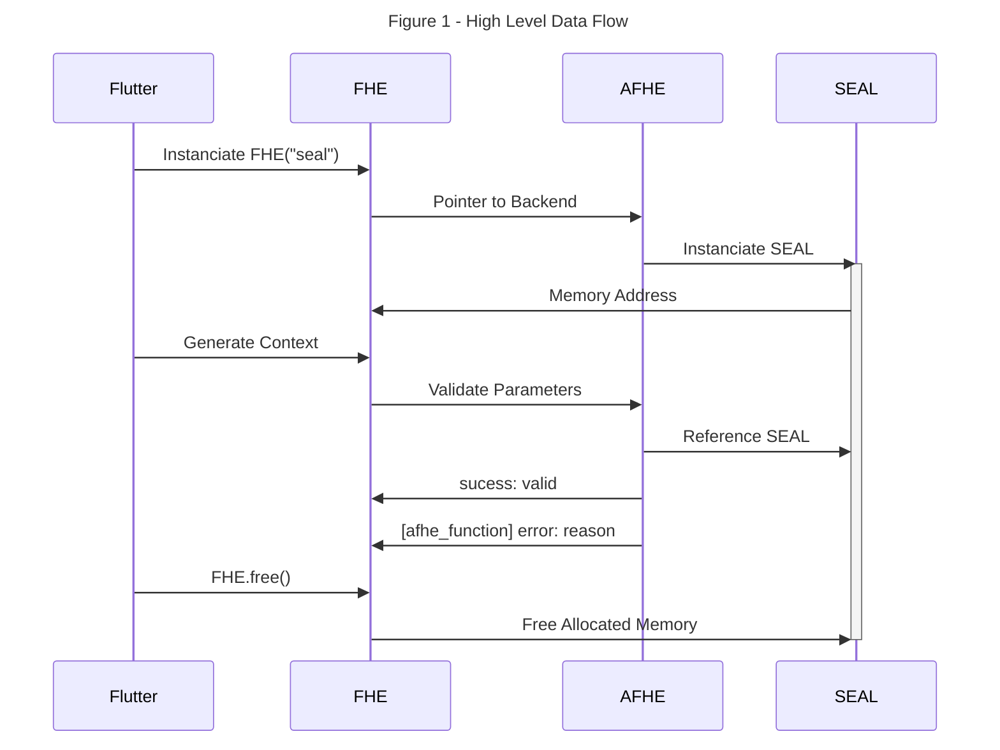
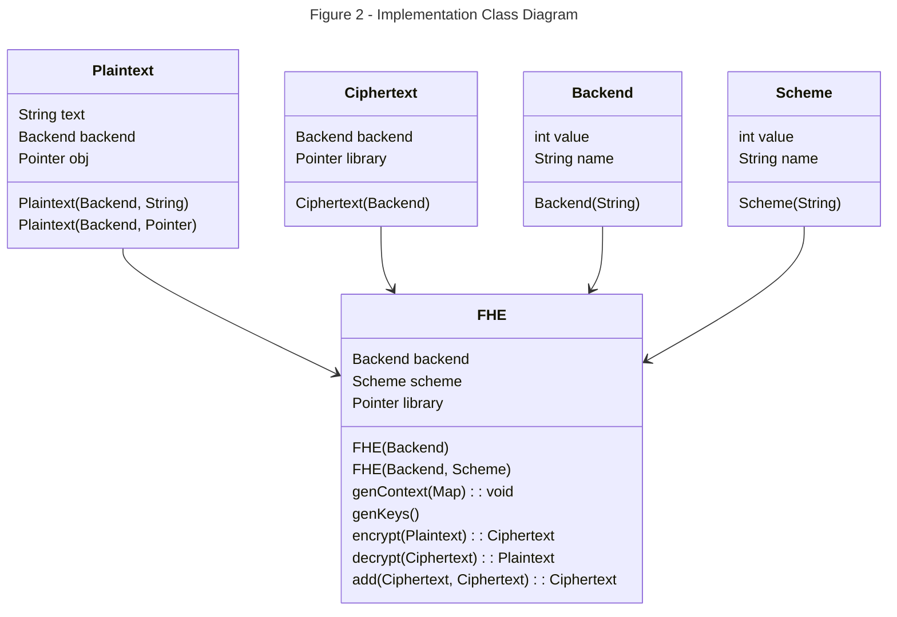
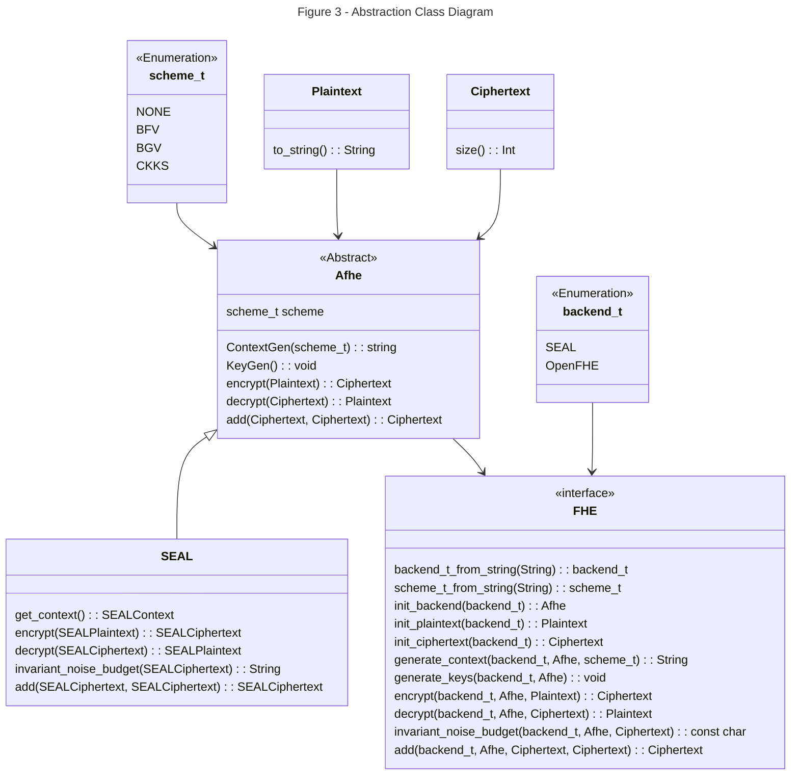

# FHEL

The FHEL (Fully Homomorphic Encryption Library) is a powerful encryption library that enables fully homomorphic encryption (FHE) capabilities. It provides a seamless integration with Flutter, allowing developers to perform secure computations on encrypted data on resource constrained devices.

At the core of this library is an abstract wrapper around existing FHE Libraries via AFHEL (Abstract FHE Library). The AFHEL exposes basic C functionalities to be consumed by Dart. The Dart adapter layer, FHE, acts as an consumer friendly API interface between Flutter and AFHEL. Using Object Oriented Programming, OOP, the FHE models itself as a library with basic functionalities of the desired backend library.

This library aims to expose basic functionalities to Flutter users to generate encryption context, derive keys, encrypt and decrypt data, and perform arithmetic operations on encrypted data. It provides a high-level abstraction for working with plaintext and ciphertext values, as well support for multiple encryption schemes.

With FHEL, developers can leverage the power of fully homomorphic encryption to perform computations on sensitive data while preserving privacy and security. It opens up new possibilities for secure data processing in applications built with Flutter.

## FHE: Implementation Layer

Fully Homomorphic Encryption (FHE)

The [adapter](https://refactoring.guru/design-patterns/adapter) design of this library interfaces with the abstraction layer. Using [dart:ffi](https://pub.dev/packages/ffi), Dart can execute C functions, reference memory addresses of C objects, and convert primitive data types.

**Legend**:

* `FHE`: Models the desired backend FHE library and encryption schemas. Enables callers execute basic FHE functionalities.

* `Plaintext`: Represents a plaintext value and contains a Pointer with the memory address of AFHE Plaintext.

* `Ciphertext`: Represents an encrypted ciphertext value and contains a Pointer with the memory address of AFHE Ciphertext.

* `Backend`: Contains integer and string value to convert to C Enum backend, for example `backend_t::seal`.

* `Scheme`: Contains integer and string value to convert to C Enum scheme, for example `scheme_t::bfv`.

## AFHE: Abstraction Layer

Abstract Fully Homomorphic Encryption Library (AFHE)

The [bridge](https://refactoring.guru/design-patterns/bridge) design of this library implements an abstraction layer over existing Fully Homomorphic Encryption (FHE) libraries. Through abstraction, we can interface with various backend libraries via the same function calls. The interface layer, FHE, exposes Afhe concrete classes, ex. Aseal, lower level C function to be consumed by the Implementation Layer. Through the use of pointers, we can create/destroy/reference Afhe objects from Dart.

**Legend**:

* `Afhe`: An abstract class representing the main functionality of the library. It has an integer attribute scheme_t that determines the encryption scheme(s) are supported. It provides methods for generating keys, encrypting and decrypting data, and performing addition operations.

* `SEAL`: A concrete, refined abstraction, class that extends Afhe and represents a specific implementation of the library using the SEAL encryption scheme. It provides its own implementations of the encryption, decryption, and addition methods.

* `FHE`: An interface that defines a method get_backend for obtaining an instance of Afhe based on a given backend library type, SEAL, that will execute the appropriate function call.

* `Plaintext` & `Ciphertext`: An abstract class representing the basic functionality of text objects. Used as the main interface for backend required parameters.

* `backend_t`: An enumeration class representing different Fully Homomorphic Encryption libraries.

* `scheme_t`: An enumeration class representing different encryption schemes, including BFV, BGV, and CKKS.
