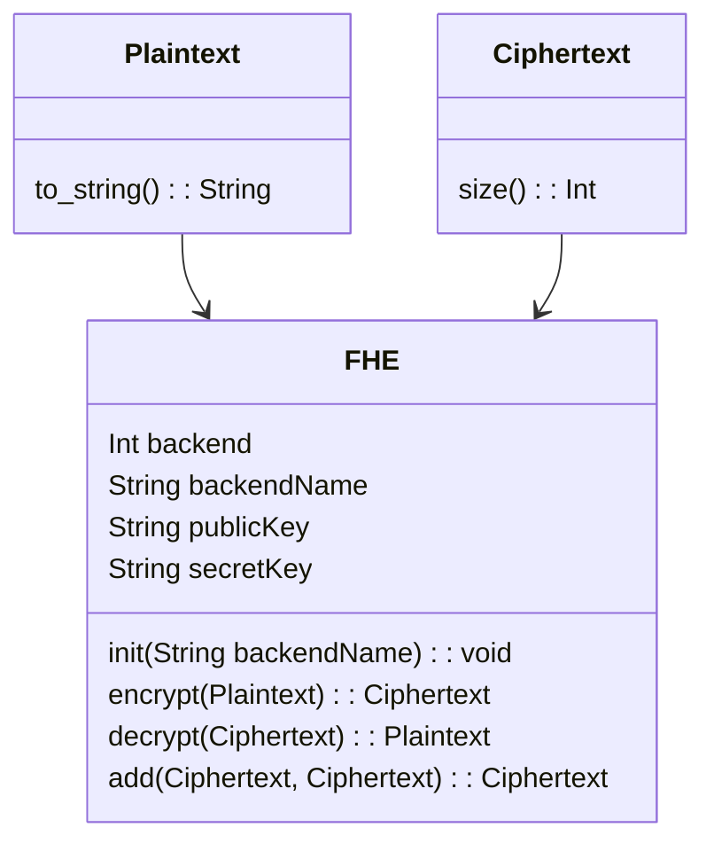

# Implementation Layer

The design of this library implements the abstraction layer, [README.md](../include/README.md), that acts as an interface to enable basic Fully Homomorphic Encryption (FHE) functionality.

Legend:
* `Plaintext`: Represents a plaintext value and provides a `to_string()` method to convert it to a string.

* `Ciphertext`: Represents an encrypted ciphertext value and provides a `size()` method to get its size.

* `FHE`: The main class that implements the Fully Homomorphic Encryption (FHE) functionality. It has the following properties and methods:
    * `backend`: An integer representing the backend.
    * `backendName`: A string representing the name of the backend.
    * `publicKey`: A string representing the public key.
    * `secretKey`: A string representing the secret key.
    * `init(backendName)`: Initializes the FHE instance with the specified backend name.
    * `encrypt(Plaintext)`: Encrypts a plaintext value and returns a ciphertext.
    * `decrypt(Ciphertext)`: Decrypts a ciphertext value and returns a plaintext.
    * `add(Ciphertext, Ciphertext)`: Adds two ciphertexts and returns the result as a new ciphertext.

