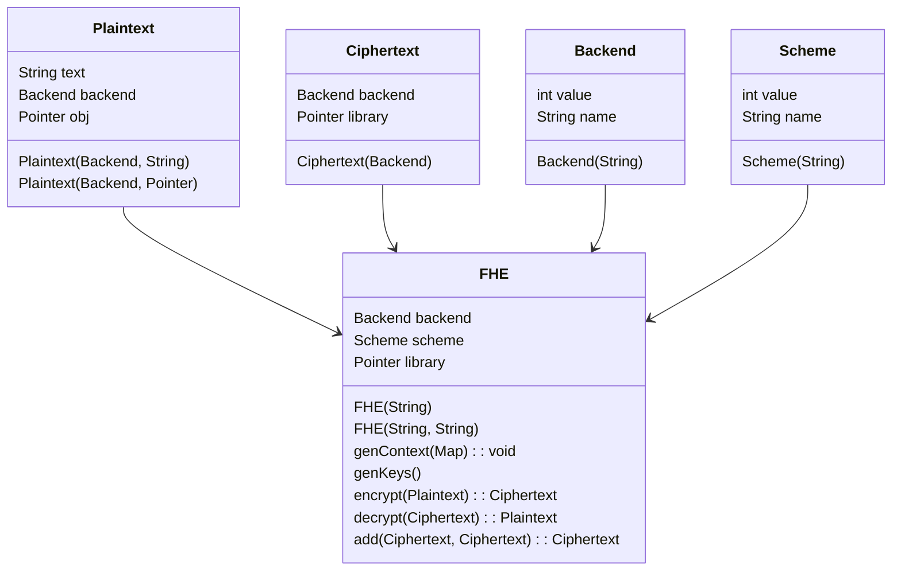

# Implementation Layer

The [adapter](https://refactoring.guru/design-patterns/adapter) design of this library interfaces with the abstraction layer, [README.md](../include/README.md). Using [dart:ffi](https://pub.dev/packages/ffi), Dart can execute C functions, reference memory addresses of object, and convert primitive data types.

Legend:
* `Plaintext`: Represents a plaintext value and provides a `to_string()` method to convert it to a string.

* `Ciphertext`: Represents an encrypted ciphertext value and provides a `size()` method to get its size.

* `FHE`: Models the desired backend FHE library and encryption schemas. Enables callers execute basic FHE functionalities.

