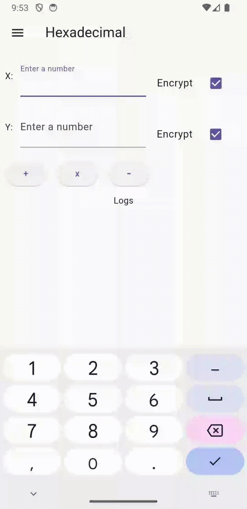
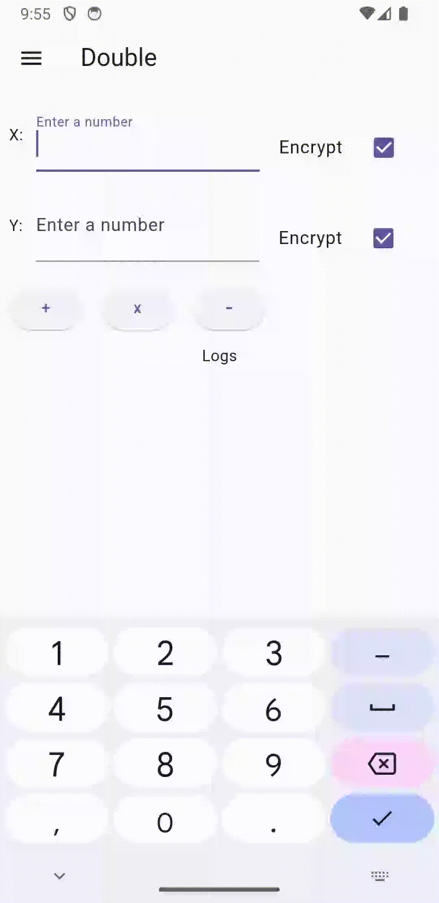

# Fully Homomorphic Encryption Calculator

Demonstrates how to use the fhel plugin integrates into an Flutter Application.

| Supported | Function
| --- | ---
| Platform | Android
| Data Types | Hexadecimal, List[Int], Double, List[Double]
| Schemes | BFV, BGV, CKKS
| Mathematics | Add, Multiply, Subtract

Note: Division has open [issue](https://github.com/jeffmur/fhel/issues/55)

## Getting Started

Compile AFHEL + Dependencies (SEAL):

From the root of this directory, install via CMakeLists.txt
```zsh
cmake -S . -B build -DUNIT_TEST=OFF
cmake --build build
cd example && flutter build apk
```

Note: `UNIT_TEST` enables/disables GTest Suite. \
For APK releases, they are not needed, and it may fail compilation.

OR via Makefile
```zsh
make build-cmake
make apk
```

## Demo

To configure Microsoft SEAL, there are 3 supported schemes: BFV, BGV, and CKKS. If you'd like, there are default parameters available to get started.

### Addition

| Hexadecimal | Double | List[Int] | List[Double] |
| --- | --- | --- | ---
|  |  |  |  | 

### Settings


