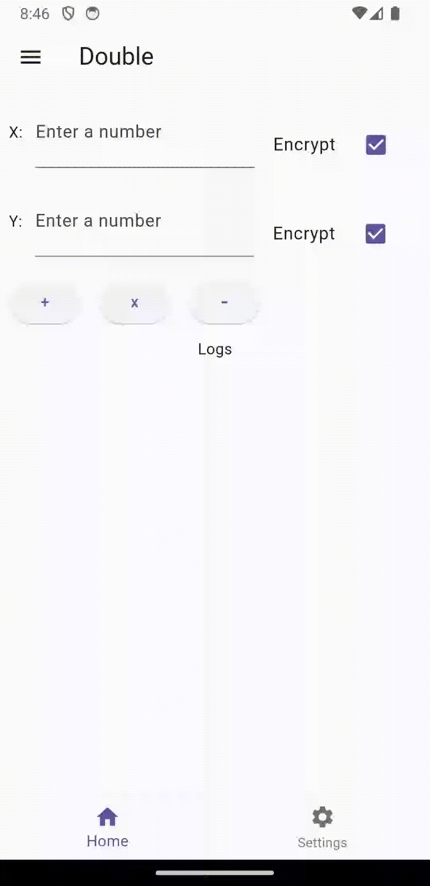
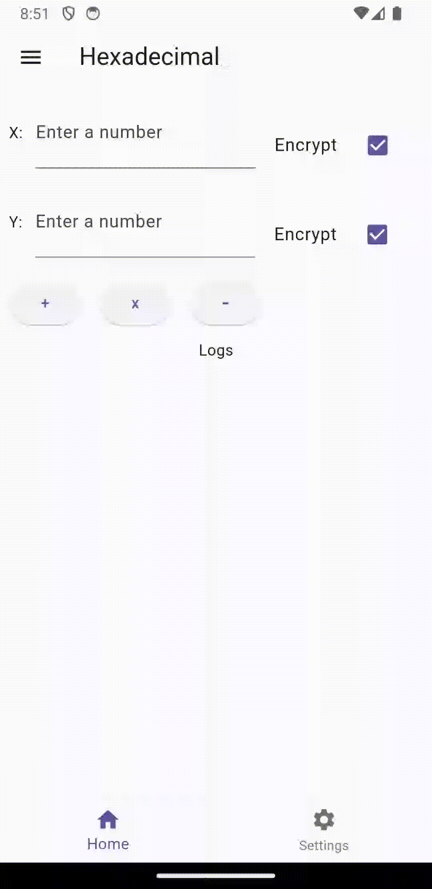
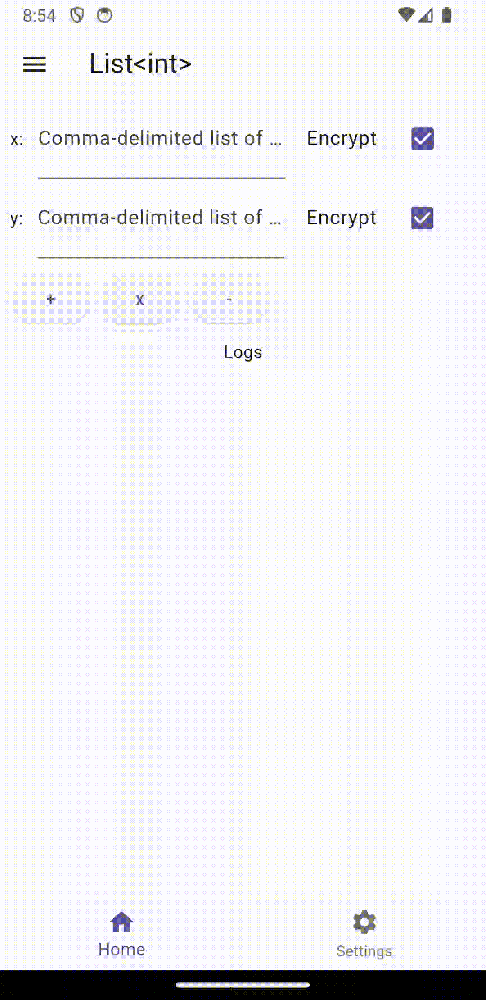
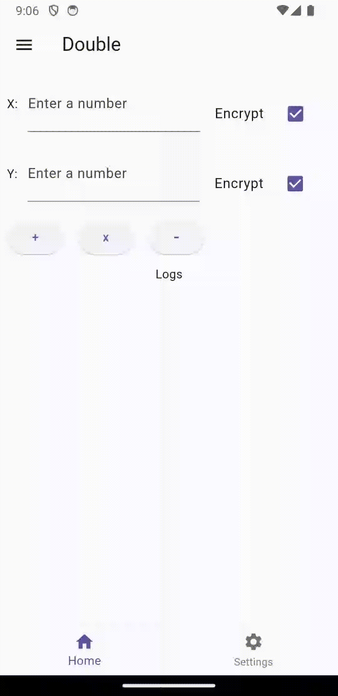

# Fully Homomorphic Encryption Calculator

Demonstrates how to use the fhel plugin integrates into an Flutter Application.

| Supported | Function
| --- | ---
| Platform | Android
| Data Types | Hexadecimal, List[Int], Double, List[Double]
| Schemes | BFV, BGV, CKKS
| Mathematics | Add, Multiply, Subtract

Note: Division has open [issue](https://github.com/jeffmur/fhel/issues/55)

## Getting Started

Compile AFHEL + Dependencies (SEAL):

From the root of this directory, install via CMakeLists.txt
```zsh
cmake -S . -B build -DUNIT_TEST=OFF
cmake --build build
cd example && flutter build apk
```

Note: `UNIT_TEST` enables/disables GTest Suite. \
For APK releases, they are not needed, and it may fail compilation.

OR via Makefile
```zsh
make build-cmake
make apk
```

## Demo


### Addition

<p float="center">
  
  
   
  
</p>

### Multiplication

<p float="center">
  
  
   
  
</p>

### Subtraction

<p float="center">
  
  
   
  
</p>


### Settings

To configure Microsoft SEAL, there are 3 supported schemes: BFV, BGV, and CKKS. If you'd like, there are default parameters available to get started. Toggling Default Parameters, will autofill default parameters. Once Validate is clicked, the parameters will be verified and keys will be generated.

On success, a green banner will appear with 'success: valid'
On failure, a red banner will appear with the corresponding error.


