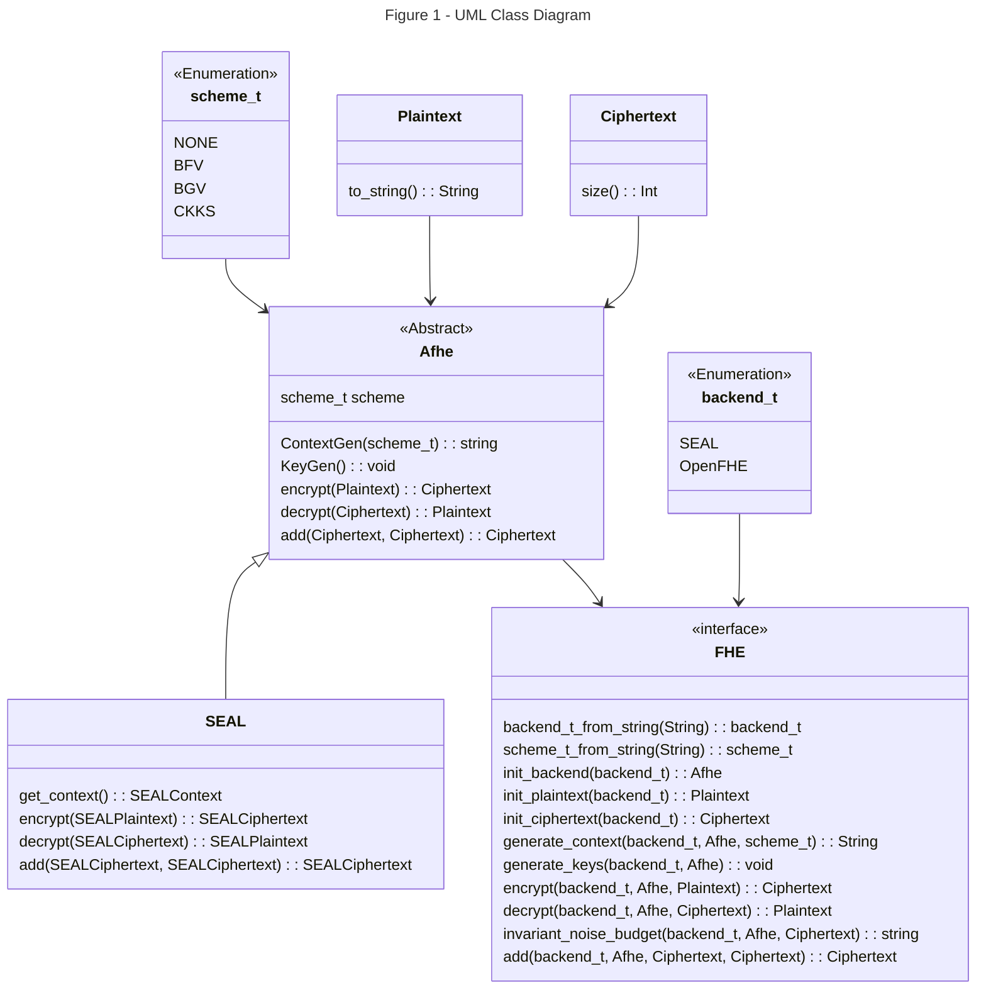

# Abstraction Layer

The [bridge](https://refactoring.guru/design-patterns/bridge) design of this library implements an abstraction layer over existing Fully Homomorphic Encryption (FHE) libraries. Through abstraction, we can interface with various backend libraries via the same function calls.

Legend:

* `Afhe`: An abstract class representing the main functionality of the library. It has an integer attribute scheme_t that determines the encryption scheme(s) are supported. It provides methods for generating keys, encrypting and decrypting data, and performing addition operations.

* `SEAL`: A concrete, refined abstraction, class that extends Afhe and represents a specific implementation of the library using the SEAL encryption scheme. It provides its own implementations of the encryption, decryption, and addition methods.

* `FHE`: An interface that defines a method get_backend for obtaining an instance of Afhe based on a given backend library type, SEAL, that will execute the appropriate function call.

* `Plaintext` & `Ciphertext`: An abstract class representing the basic functionality of text objects. Used as the main interface for backend required parameters.

* `backend_t`: An enumeration class representing different Fully Homomorphic Encryption libraries.

* `scheme_t`: An enumeration class representing different encryption schemes, including BFV, BGV, and CKKS.
