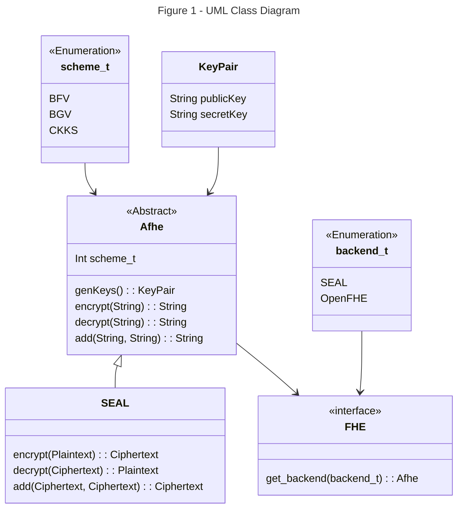

# Fully Homomorphic Encryption Library

The design of this library implements an abstraction layer over existing Fully Homomorphic Encryption (FHE) libraries. Through abstraction, we can interface with various backend libraries via the same function calls.

Legend:

* `Afhe`: An abstract class representing the main functionality of the library. It has an integer attribute scheme_t that determines the encryption scheme used. It provides methods for generating keys, encrypting and decrypting data, and performing addition operations.

* `SEAL`: A concrete class that extends Afhe and represents a specific implementation of the library using the SEAL encryption scheme. It provides its own implementations of the encryption, decryption, and addition methods.

* `FHE`: An interface that defines a method get_backend for obtaining an instance of Afhe based on a given backend library type.

* `backend_t`: An enumeration class representing different Fully Homomorphic Encryption libraries.

* `scheme_t`: An enumeration class representing different encryption schemes, including BFV, BGV, and CKKS.

* `KeyPair`: A class representing a pair of public and secret keys used for encryption and decryption.